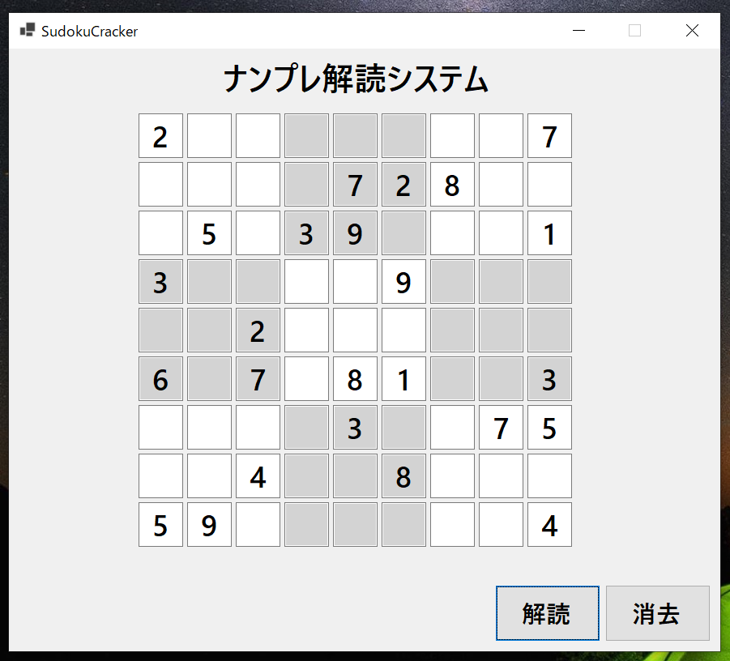

# ナンプレ解読システム

## 概要

ナンプレを解読できるWindowsアプリケーションです。

あらゆるナンプレを一瞬で解くことができます。

## 使用技術

C#/Windows Forms

## 使い方

1. 9×9のマスに解きたいナンプレと同じ数字を入力します。

2. **解読ボタン**を押すとナンプレが自動で解読されます。

3. **消去ボタン**を押せばマス内の数字を消去できます。

©2023 Reiji Ogura
